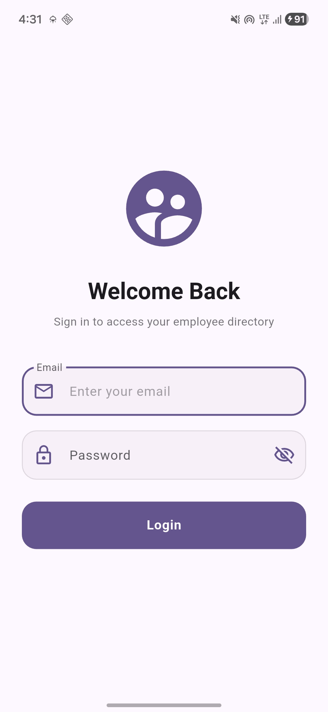
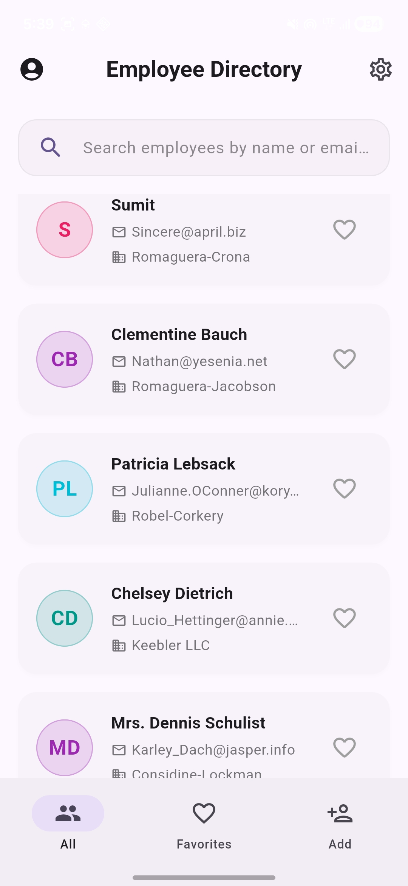
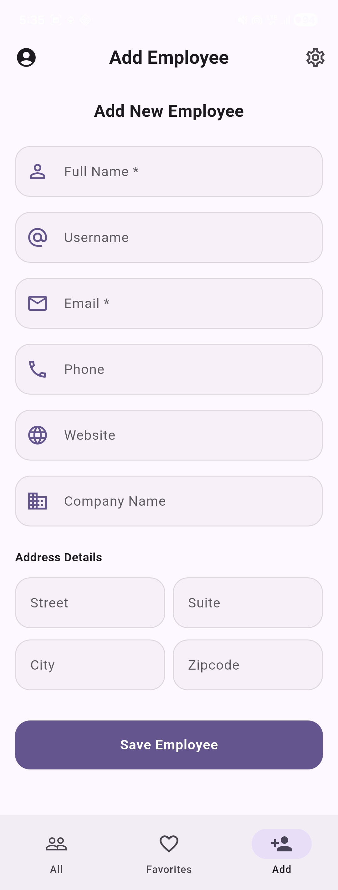
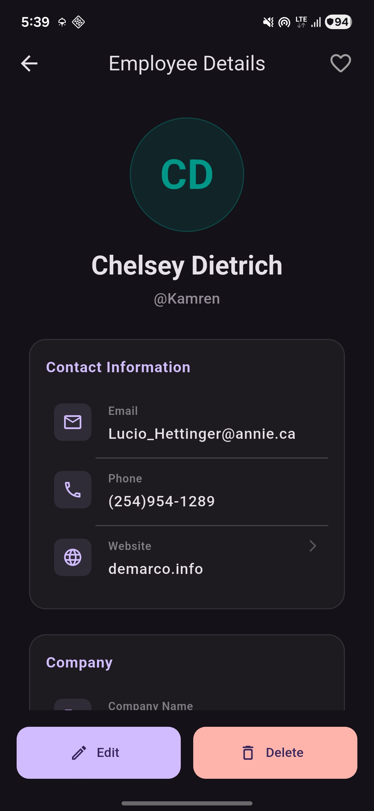
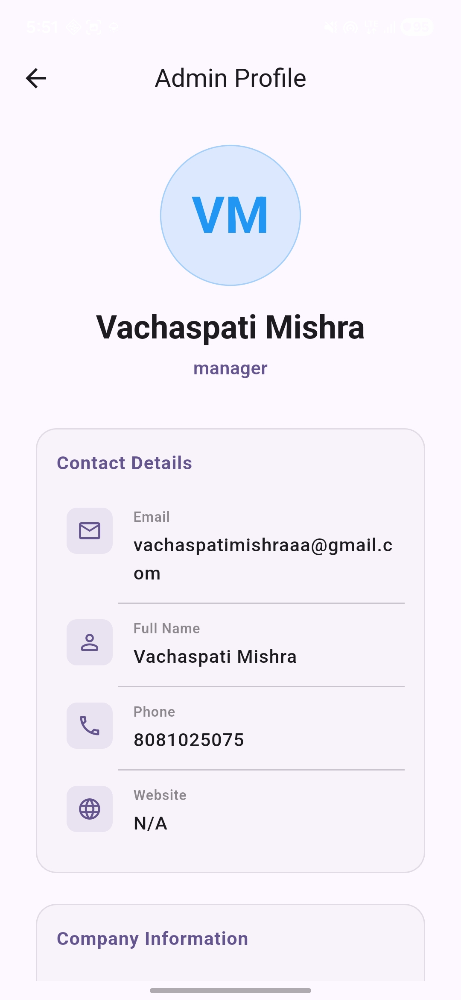
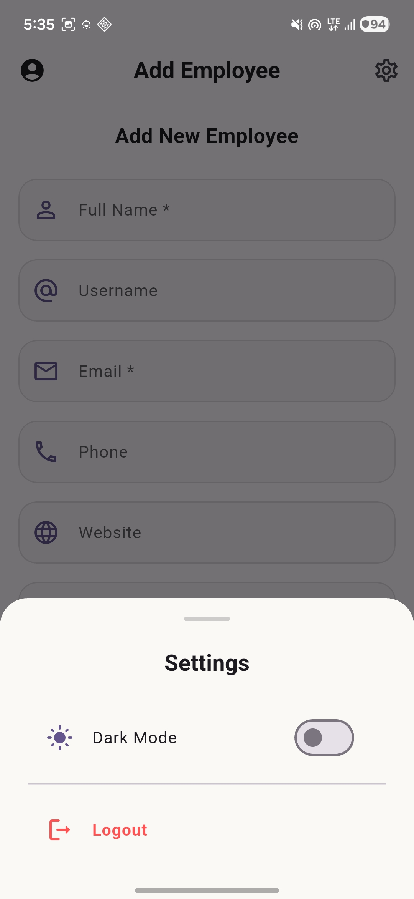

# 👨‍💼 Employee Directory


<p align="center">
A modern <b>Flutter Employee Directory</b> application built using <b>MVVM + Repository Pattern + Riverpod</b>. The application enables administrators to manage employees efficiently with support for offline caching, favorites, profile management, and a clean Material 3 interface.
</p>

<p align="center">

[](https://flutter.dev/)
[](https://dart.dev/)
[]()
[]()

</p>

---

# 📱 Download APK

<p align="center">

## ⬇️ **[Download Latest APK](https://github.com/vachaspatimishraa/employee_directory/raw/main/apk/app-release.apk)**

</p>

> Replace the above URL with your GitHub Releases APK link before publishing.

---

# ✨ Features

## 🔐 Authentication
[build](build)
- Login Screen
- Email Validation
- Password Validation
- Auto Login
- Session Persistence
- Existing User Recognition
- Local Authentication
- Secure User Storage

---

## 👥 Employee Management

- View Employees
- Search Employees
- Add Employee
- Edit Employee
- Delete Employee
- Employee Details
- Favorite Employees
- Pull to Refresh

---

## 👤 Admin Profile

- Editable Admin Profile
- First Login Setup
- Persistent Profile
- Read-only Email
- Material 3 UI

---

## 💾 Offline Support

- Isar Database
- Offline Caching
- Cached Employee Data
- Works without Internet

---

## 🎨 UI

- Material 3
- Responsive Layout
- Dark Mode
- Light Mode
- Hero Animation
- Shimmer Loading
- Error States
- Empty States

---

# 📸 Screenshots

| Login | All Employees | Add Employee |
|--------|--|--------------|
|  |  |  |

| Employee Details | Admin Profile | Settings |
|------------------|---------------|----------|
|  |  |  |


---

# 🏗 Architecture

The project follows **MVVM Architecture** with the **Repository Pattern**.

```text
                UI Layer
            (Flutter Screens)

                    │

                    ▼

          Riverpod ViewModels

                    │

                    ▼

           Repository Pattern

            ┌──────────────┐
            │              │
            ▼              ▼

        Remote API      Local Database
           (Dio)            (Isar)
```

---

# 📂 Project Structure

```text
lib
│
├── app
├── core
├── features
│   ├── auth
│   ├── employee
│   └── settings
│
├── routes
└── main.dart
```

---

# 🛠 Tech Stack

| Technology | Purpose |
|------------|---------|
| Flutter | Cross-platform UI |
| Dart | Programming Language |
| Riverpod | State Management |
| Dio | REST API |
| Isar | Offline Database |
| SharedPreferences | Authentication Session |
| GoRouter | Navigation |
| Material 3 | UI Design |
| Connectivity Plus | Internet Monitoring |

---

# 📦 Packages Used

- flutter_riverpod
- dio
- go_router
- isar
- isar_flutter_libs
- shared_preferences
- connectivity_plus
- path_provider
- url_launcher
- flutter_svg
- shimmer
- intl
- equatable

---

# 🌐 API

Employee data is fetched from

```text
https://jsonplaceholder.typicode.com/users
```

---

# 🚀 Application Flow

```text
Login

      │

      ▼

Employee Directory

      │

 ┌────┼─────────────┐
 │    │             │
 ▼    ▼             ▼

All  Favorites   Add Employee

 │

 ▼

Employee Details

 │

 ▼

Edit / Delete
```

---

# 📋 Modules

## Authentication

- Login
- Session Storage
- User Recognition
- Logout

---

## Employees

- Employee List
- Search
- Add
- Edit
- Delete
- Favorites

---

## Profile

- Admin Profile
- Edit Profile
- Save Profile

---

## Settings

- Dark Mode
- Logout

---

# ⚙️ Setup Instructions

## Prerequisites

- Flutter SDK **3.41.x**
- Dart SDK **3.9.x**
- Android Studio or VS Code
- Git

Verify installation

```bash
flutter doctor
```

---

## Clone Repository

```bash
git clone https://github.com/yourusername/employee-directory.git
```

---

## Navigate

```bash
cd employee-directory
```

---

## Install Packages

```bash
flutter pub get
```

---

## Generate Isar Files

```bash
dart run build_runner build --delete-conflicting-outputs
```

---

## Run Application

```bash
flutter run
```

---

# 🧪 Run Tests

```bash
flutter test
```

---

# 📦 Build APK

Debug

```bash
flutter build apk
```

Release

```bash
flutter build apk --release
```

Generated APK

```text
build/app/outputs/flutter-apk/app-release.apk
```

---

# 📌 Flutter Version

| Tool | Version |
|------|---------|
| Flutter | 3.41.x |
| Dart | 3.9.x |

> Replace with the exact output of `flutter --version` before publishing.

---

# 📖 Assumptions

- Authentication is local only.
- Email acts as the unique identifier.
- Existing users must log in using the original password.
- Employee data from the API is cached locally.
- Added employees are stored locally.
- The administrator profile is separate from employee records.
- Offline mode displays cached employee data.
- Favorites persist locally.

---

# 🚀 Future Improvements

- Firebase Authentication
- Cloud Sync
- Employee Images
- Role-based Access
- Multi-language Support
- Push Notifications
- Integration Tests
- CI/CD Pipeline

---

# 👨‍💻 Developed By

**Lucky**

Flutter Developer

---

# ⭐ Support

If you found this project useful, consider giving it a ⭐ on GitHub!

---

# 📄 License

This project was developed for a Flutter interview assessment and educational purposes.